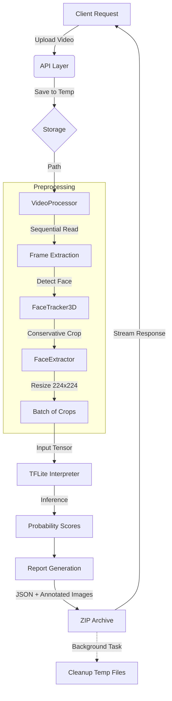
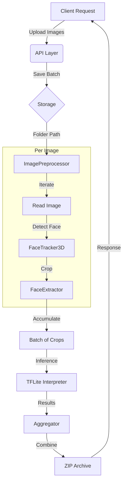
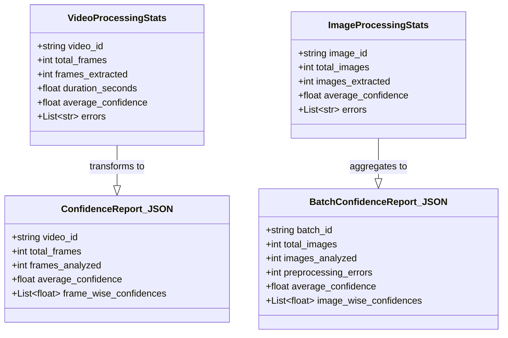

# ML Engine Architecture

This document details the internal architecture of the **Deep Guard ML Engine**. This service is responsible for the heavy lifting of media processing, face extraction, and deepfake inference.

## 🏗️ High-Level Design

The ML Engine is a **stateless microservice** built with **FastAPI**. It accepts media inputs, processes them ephemerally, and returns results immediately (or via ZIP downloads). It does not maintain a database; it relies on the caller (Backend) for persistence.

### Key Components

1.  **API Layer (`app/routes`)**: Handles HTTP requests, validation, and response formatting (using `FileResponse` for ZIPs).
2.  **Orchestration Layer (`app/services`)**: Coordinates the flow between file saving, preprocessing, inference, and cleanup.
    -   `VideoPreprocessor`: Manages frame extraction strategies.
    -   `ImagePreprocessor`: Handles batch image operations.
3.  **Core Logic (`app/utils`)**: Contains the sophisticated computer vision algorithms.
    -   `FaceTracker3D`: Detects and tracks faces across frames to ensure the *same* face is analyzed consistently.
    -   `FaceExtractor`: Handles "conservative cropping" to minimize background noise while keeping the face centered.
    -   `VideoProcessor`: Implements an optimized frame reading loop.
4.  **Inference Layer (`app/services/model.py`)**: A wrapper around the TensorFlow Lite interpreter.

## 📊 Workflow Diagrams

### Video Analysis Workflow

### Image Batch Workflow

## 🧩 Internal Data Models

The ML Engine uses Python `dataclasses` for internal state tracking and strictly formatted JSON for reporting.

## 🔄 Core Pipelines

### 1. Video Analysis Pipeline (`/detect/deepfake/video`)

The video processing pipeline is optimized for speed and memory efficiency:

1.  **Upload & Save:** Video is saved to a temporary UUID-based directory.
2.  **Preprocessing (`VideoProcessor`):**
    -   **Optimization:** Uses `cv2.CAP_PROP_BUFFERSIZE = 1` to reduce latency.
    -   **Sampling:** Calculates uniform indices to extract exactly $N$ frames (default 50) spread across the video duration.
    -   **Sequential Read:** Iterates through the video *once*, skipping frames until a target index is reached (faster than `cap.set(cv2.CAP_PROP_POS_FRAMES)` for many formats).
    -   For each target frame:
        -   **Detection:** Finds face landmarks.
        -   **Tracking:** Correlates with previous frames.
        -   **Crop & Resize:** Extracts a $224 \times 224$ (or model-specific size) RGB image.
3.  **Inference:**
    -   The extracted batch of face crops is passed to the **TFLite Interpreter**.
    -   Inference runs on the CPU (optimized for standard server instances).
4.  **Reporting:**
    -   A JSON report (`confidence_report.json`) is generated.
    -   Annotated frames (with bounding boxes and confidence labels) are saved.
    -   All artifacts are zipped into a single archive.
5.  **Response:** The ZIP file is streamed back to the client.
6.  **Cleanup:** A `BackgroundTasks` job deletes the temporary directory after the response is sent.

### 2. Image Batch Pipeline (`/detect/deepfake/images`)

1.  **Batch Upload:** Accepts a list of image files.
2.  **Iteration:** Processes each image independently.
3.  **Strict Mode:** If face detection fails for an image, it is logged as an error but does not fail the entire batch.
4.  **Aggregation:** Results from all successful images are aggregated into a single `confidence_report.json` and ZIP archive.

## 🧠 Model & Inference

-   **Model Format:** TensorFlow Lite (`.tflite`).
-   **Model Architecture:** Xception-based binary classifier (Real vs. Fake).
-   **Input Shape:** Typically $224 \times 224 \times 3$ (RGB).
-   **Output:** Binary classification probability (0.0 - 1.0).
    -   $0.0 \rightarrow 0.5$: Real
    -   $0.5 \rightarrow 1.0$: Fake

## 🏎️ Performance Optimizations

1.  **Pre-allocated Arrays:** The `VideoProcessor` pre-allocates lists for successful frames to avoid dynamic array resizing overhead during the loop.
2.  **Sequential Reading:** Seeking in video files can be slow (Keyframe dependent). By reading sequentially and skipping, we maintain a consistent throughput.
3.  **TFLite:** Using the TFLite runtime instead of the full TensorFlow heavy library significantly reduces startup time and memory footprint (RAM).

## ⚠️ Error Handling

-   **Strict Processing:** The pipeline often rejects artifacts that are ambiguous (e.g., "No face detected"). This ensures high-quality data for the model.
-   **Delayed Cleanup:** All temporary files are managed with `app.utils.delayed_cleanup` to prevent disk exhaustion, even if the application crashes or errors out during a request.
